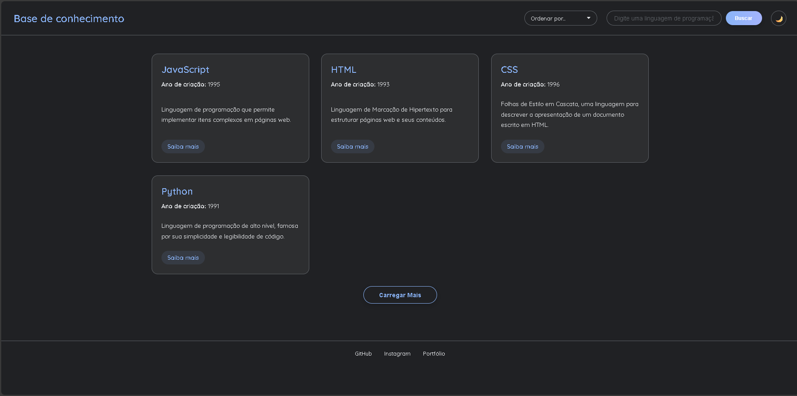

# Base de Conhecimento de Tecnologias Web

Uma aplicação de página única (SPA) moderna, interativa e responsiva para navegar e pesquisar informações sobre diversas tecnologias de desenvolvimento web.

## 🖼️ Screenshot



## 🎥 Vídeo de Demonstração

[Clique aqui para ver um vídeo de demonstração do projeto](20251119-1400-09.7408446.mp4)

---

## ✨ Funcionalidades

-   **Conteúdo Dinâmico:** Os artigos são carregados dinamicamente a partir de um arquivo `data.json`.
-   **Busca em Tempo Real:** Filtre os artigos por nome ou descrição.
-   **Paginação Inteligente:** O botão "Carregar Mais" exibe mais artigos sob demanda.
-   **Alternador de Tema:** Escolha entre um tema claro e um escuro. Sua preferência é salva no navegador.
-   **Ordenação Flexível:** Organize os resultados por nome (A-Z, Z-A) ou por ano de criação (mais recente, mais antigo).
-   **Design Responsivo:** A interface se adapta perfeitamente a desktops, tablets e celulares.
-   **Estilo Moderno:** Animações suaves, layout em grid e um design profissional.

---

## 🚀 Tecnologias Utilizadas

-   **HTML5:** Para a estrutura da página.
-   **CSS3:** Para a estilização, utilizando recursos modernos como Grid, Flexbox e Variáveis CSS.
-   **JavaScript (ES6+):** Para toda a interatividade, manipulação do DOM e lógica da aplicação.

---

## 📂 Estrutura dos Arquivos

```
.
├── 📄 index.html      # Arquivo principal da página
├── 🎨 style.css       # Folha de estilos (aparência e responsividade)
├── ⚙️ script.js       # Lógica da aplicação (busca, tema, ordenação, etc.)
└── 📦 data.json       # Base de dados com as informações das tecnologias
```

---

## 🏃 Como Executar

Este é um projeto puramente front-end. Não é necessário um servidor ou processo de build.

1.  Clone ou baixe este repositório.
2.  Abra o arquivo `index.html` diretamente no seu navegador de preferência (Google Chrome, Firefox, etc.).

E pronto! A aplicação estará funcionando.
